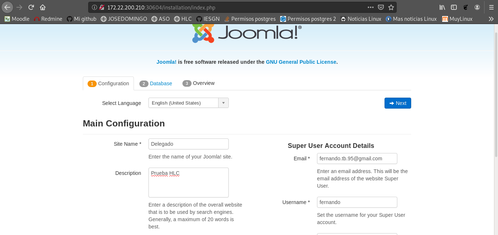
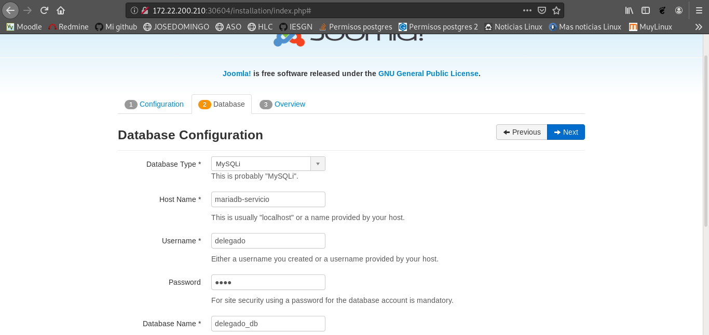
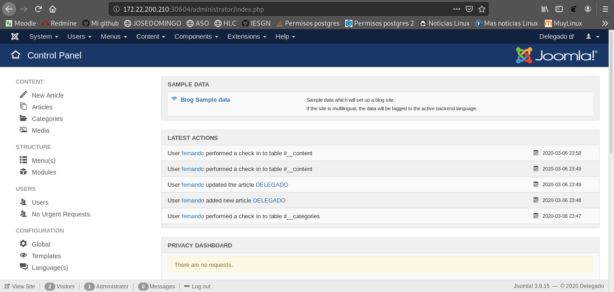
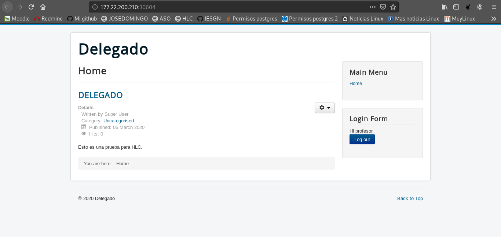

# KUBERNETES

En esta tarea vamos a realizar un cluster de Kubernetes con 'kubeadm'. Vamos a montar nuestro escenario sobre Openstack, y va a constar de 1 master (172.22.200.210) y de 2 nodos (172.22.201.70, 172.22.201.74).

Antes de empezar, vamos a abrir los puertos del 30000 al 40000 en las reglas de seguridad de Openstack, ya que son los que usa Kubernetes.

Lo primero que tenemos que hacer es cambiar la versión de iptables en las máquinas, ya que nftables puede dar conflictos con Kubernetes:

~~~
sudo apt update
sudo apt install -y iptables arptables ebtables
sudo update-alternatives --set iptables /usr/sbin/iptables-legacy
sudo update-alternatives --set ip6tables /usr/sbin/ip6tables-legacy
sudo update-alternatives --set arptables /usr/sbin/arptables-legacy
sudo update-alternatives --set ebtables /usr/sbin/ebtables-legacy
~~~

Tras esto, vamos a instalar docker en las 3 máquinas:

~~~
debian@kubeadm:~$ sudo apt install docker.io
debian@nodo1k8s:~$ sudo apt install docker.io
debian@nodo2k8s:~$ sudo apt install docker.io
~~~

Ahora vamos a hacer la instalación en las 3 máquinas de una serie de herramientas para realizar la gestión del cluster:

- kubeadm -> Herramienta para crear el cluster. 
- kubelet -> Herramienta que se ejecuta en todos los nodos y se dedica a iniciar los pods y contenedores.
- kubectl -> Herramienta para controlar el cluster.

~~~
debian@kubeadm:~$ sudo apt-get update && sudo apt-get install -y apt-transport-https curl gnupg2
debian@kubeadm:~$ curl -s https://packages.cloud.google.com/apt/doc/apt-key.gpg | sudo apt-key add -
OK
debian@kubeadm:~$ cat <<EOF | sudo tee /etc/apt/sources.list.d/kubernetes.list
deb https://apt.kubernetes.io/ kubernetes-xenial main
EOF
deb https://apt.kubernetes.io/ kubernetes-xenial main
debian@kubeadm:~$ sudo apt-get update
debian@kubeadm:~$ sudo apt-get install -y kubelet kubeadm kubectl
~~~

Marcamos los paquetes para que se retengan y no puedan actualizarse o eliminarse de forma automática:

~~~
debian@kubeadm:~$ sudo apt-mark hold kubelet kubeadm kubectl
kubelet set on hold.
kubeadm set on hold.
kubectl set on hold.
~~~

Apagamos la SWAP:

~~~
debian@kubeadm:~$ sudo swapoff -a
~~~

Finalmente iniciamos el cluster en el master, y además vamos a almacenar el join y el token que nos aparece al final:

~~~
debian@kubeadm:~$ sudo kubeadm init --pod-network-cidr=192.168.20.0/24 --apiserver-cert-extra-sans=172.22.200.210
...
Your Kubernetes control-plane has initialized successfully!

To start using your cluster, you need to run the following as a regular user:

  mkdir -p $HOME/.kube
  sudo cp -i /etc/kubernetes/admin.conf $HOME/.kube/config
  sudo chown $(id -u):$(id -g) $HOME/.kube/config

You should now deploy a pod network to the cluster.
Run "kubectl apply -f [podnetwork].yaml" with one of the options listed at:
  https://kubernetes.io/docs/concepts/cluster-administration/addons/

Then you can join any number of worker nodes by running the following on each as root:

kubeadm join 10.0.0.3:6443 --token gb1uuk.3zi3kmth08do9yo2 \
    --discovery-token-ca-cert-hash sha256:1e42adbb8b2f57e84d9c2de5596fbe3b58c156e35e547183ba879e902b273da7
~~~

Ahora vamos a ejecutar en el master lo que nos indica el comando ejecutado con anterioridad:

~~~
debian@kubeadm:~$ mkdir -p $HOME/.kube
debian@kubeadm:~$ sudo cp -i /etc/kubernetes/admin.conf $HOME/.kube/config
debian@kubeadm:~$ sudo chown $(id -u):$(id -g) $HOME/.kube/config
~~~

Tras esto vamos a realizar la instalación de 'Weave' en el master, que se trata de un proyecto que proporciona pod network a Kubernetes para permitir la comunicación con otros nodos:

~~~
debian@kubeadm:~$ kubectl apply -f "https://cloud.weave.works/k8s/net?k8s-version=$(kubectl version | base64 | tr -d '\n')"
~~~

Ahora vamos a conectar el nodo 1 con el master usando el token que adquirimos anteriormente:

~~~
debian@nodo1k8s:~$ sudo kubeadm join 10.0.0.3:6443 --token gb1uuk.3zi3kmth08do9yo2 \
--discovery-token-ca-cert-hash sha256:1e42adbb8b2f57e84d9c2de5596fbe3b58c156e35e547183ba879e902b273da7
~~~

Hacemos lo mismo en el nodo 2:

~~~
debian@nodo2k8s:~$ sudo kubeadm join 10.0.0.3:6443 --token gb1uuk.3zi3kmth08do9yo2 \
--discovery-token-ca-cert-hash sha256:1e42adbb8b2f57e84d9c2de5596fbe3b58c156e35e547183ba879e902b273da7
~~~

Finalmente nos dirigimos al nodo master y comprobamos que la unión se ha realizado con éxito:

~~~
debian@kubeadm:~$ kubectl get nodes
NAME       STATUS   ROLES    AGE     VERSION
kubeadm    Ready    master   11m     v1.17.3
nodo1k8s   Ready    <none>   2m29s   v1.17.3
nodo2k8s   Ready    <none>   77s     v1.17.3
~~~

## INSTALACIÓN DE UNA APLICACIÓN EN UN CLUSTER CON KUBERNETES

Para esta tarea vamos a realizar la instalación del CMS Joomla.

Lo primero que tenemos que hacer es crear un namespace para el escenario:

~~~
debian@kubeadm:~$ cat joomla-ns.yml 
apiVersion: v1
kind: Namespace
metadata:
  name: joomla
~~~

Y levantarlo:

~~~
debian@kubeadm:~$ kubectl apply -f joomla-ns.yml 
namespace/joomla created
~~~

Tras esto vamos a crear un 'secreto' para almacenar información sensible de manera segura:

~~~
debian@kubeadm:~$ kubectl create secret generic mariadb-secreto --namespace=joomla \
                             --from-literal=dbuser=delegado \
                             --from-literal=dbname=delegado_db \
                             --from-literal=dbpassword=dios \
                             --from-literal=dbrootpassword=dios \
                             -o yaml --dry-run > mariadb-secreto-joomla.yml

debian@kubeadm:~$ cat mariadb-secreto-joomla.yml 
apiVersion: v1
data:
  dbname: ZGVsZWdhZG9fZGI=
  dbpassword: ZGlvcw==
  dbrootpassword: ZGlvcw==
  dbuser: ZGVsZWdhZG8=
kind: Secret
metadata:
  creationTimestamp: null
  name: mariadb-secreto
  namespace: joomla
~~~

Y lo levantamos:

~~~
debian@kubeadm:~$ kubectl apply -f mariadb-secreto-joomla.yml 
secret/mariadb-secreto created
~~~

Ahora vamos a crear el servicio y el despliegue de MariaDB: 

~~~
debian@kubeadm:~$ nano mariadb-joomla.yml 
apiVersion: v1
kind: Service
metadata:
  name: mariadb-servicio
  namespace: joomla
  labels:
    app: joomla
    type: database
spec:
  ports:
    - port: 3306
      targetPort: db-port
  selector:
    app: joomla
    type: database
  type: ClusterIP
---
apiVersion: apps/v1
kind: Deployment
metadata:
  name: mariadb-despliegue
  namespace: joomla
  labels:
    app: joomla
    type: database
spec:
  replicas: 1
  selector:
    matchLabels:
      app: joomla
  template:
    metadata:
      labels:
        app: joomla
        type: database
    spec:
      containers:
      - name: mariadb
        image: mariadb
        ports:
        - containerPort: 3306
          name: db-port
        env:
        - name: MYSQL_USER
          valueFrom:
            secretKeyRef:
              name: mariadb-secreto
              key: dbuser
        - name: MYSQL_DATABASE
          valueFrom:         
            secretKeyRef:
              name: mariadb-secreto
              key: dbname
        - name: MYSQL_PASSWORD
          valueFrom:         
            secretKeyRef:
              name: mariadb-secreto
              key: dbpassword
        - name: MYSQL_ROOT_PASSWORD
          valueFrom:         
            secretKeyRef:
              name: mariadb-secreto
              key: dbrootpassword
~~~

Y lo levantamos:

~~~
debian@kubeadm:~$ kubectl apply -f mariadb-joomla.yml 
service/mariadb-servicio created
deployment.apps/mariadb-despliegue created
~~~

Por último, vamos a crear el servicio y el despliegue de Joomla:

~~~
debian@kubeadm:~$ nano joomla.yml 
apiVersion: v1
kind: Service
metadata:
  name: joomla-servicio
  namespace: joomla
  labels:
    app: joomla
    type: frontend
spec:
  ports:
  - name: http-sv-port
    port: 80
    targetPort: http-port
  - name: https-sv-port
    port: 443
    targetPort: https-port
  selector:
    app: joomla
    type: frontend
  type: NodePort
---
apiVersion: apps/v1
kind: Deployment
metadata:
  name: joomla-despliegue
  namespace: joomla
  labels:
    app: joomla
    type: frontend
spec:
  replicas: 1
  selector:
    matchLabels:
      app: joomla
  template:
    metadata:
      labels:
        app: joomla
        type: frontend
    spec:
      containers:
      - name: joomla
        image: joomla
        ports:
         - containerPort: 80
           name: http-port
         - containerPort: 443
           name: https-port
        env:
         - name: JOOMLA_DB_HOST
           value: mariadb-servicio
         - name: JOOMLA_DB_USER
           valueFrom:
             secretKeyRef:
               name: mariadb-secreto
               key: dbuser
         - name: JOOMLA_DB_PASSWORD
           valueFrom:
             secretKeyRef:
               name: mariadb-secreto
               key: dbpassword
         - name: JOOMLA_DB_NAME
           valueFrom:
             secretKeyRef:
               name: mariadb-secreto
               key: dbname
~~~

Y lo levantamos:

~~~
debian@kubeadm:~$ kubectl apply -f joomla.yml 
service/joomla-servicio created
deployment.apps/joomla-despliegue created
~~~

Ahora vamos a observar como ha quedado el escenario:

~~~
debian@kubeadm:~$ kubectl get deploy,service,pods,secret -n joomla
NAME                                 READY   UP-TO-DATE   AVAILABLE   AGE
deployment.apps/joomla-despliegue    1/1     1            1           48m
deployment.apps/mariadb-despliegue   1/1     1            1           49m

NAME                       TYPE        CLUSTER-IP       EXTERNAL-IP   PORT(S)                      AGE
service/joomla-servicio    NodePort    10.102.45.213    <none>        80:30604/TCP,443:30348/TCP   48m
service/mariadb-servicio   ClusterIP   10.110.248.201   <none>        3306/TCP                     49m

NAME                                      READY   STATUS    RESTARTS   AGE
pod/joomla-despliegue-546d9f58cf-tb4tx    1/1     Running   3          48m
pod/mariadb-despliegue-555c86485c-4k8hf   1/1     Running   0          49m

NAME                         TYPE                                  DATA   AGE
secret/default-token-6lrkl   kubernetes.io/service-account-token   3      49m
secret/mariadb-secreto       Opaque                                4      49m
~~~

Una vez hecho esto, vamos a acceder al sitio web para introducir las credenciales y hacer la instalación:

Accedemos al panel de control y creamos un artículo:

Comprobamos que se ha creado correctamente:

